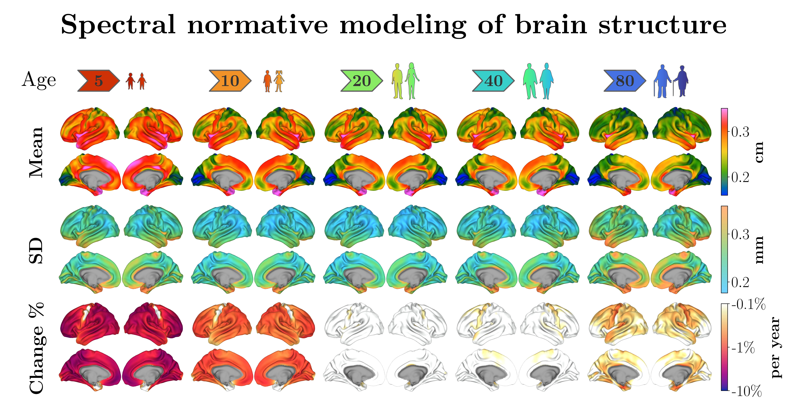

# Spectral Normative Modeling of Brain Structure



<p align="center">
  <a href="https://doi.org/10.1101/2025.01.16.25320639"></a>
  <a href="https://sina-mansour.github.io/spectranorm/"></a>
  <a href="https://pypi.python.org/pypi/spectranorm/"></a>
  <a href="LICENSE"></a>
</p>

This repository provides the complete, reproducible analysis code accompanying the manuscript:

> **Mansour L., S., et al. (2025). Spectral Normative Modeling of Brain Structure. *medRxiv*.** DOI: [10.1101/2025.01.16.25320639](https://doi.org/10.1101/2025.01.16.25320639)

The study introduces **Spectral Normative Models (SNMs)** — a framework for normative modeling of high-dimensional cortical phenotypes using spectral (eigenmode-based) representations. The repository contains every step of the analysis pipeline, from raw data preprocessing through model fitting, performance evaluation, and clinical application, enabling full reproduction of all manuscript figures and results.

---

## 🧰 SpectraNorm Package

The analysis code in this repository is built on top of **SpectraNorm** — a dedicated Python package we developed to facilitate the implementation of conventional and spectral normative models.

[](https://sina-mansour.github.io/spectranorm/)
[](https://pypi.python.org/pypi/spectranorm/)

```bash
pip install spectranorm --upgrade
```

For tutorials, API reference, and further documentation, visit the [SpectraNorm documentation site](https://sina-mansour.github.io/spectranorm/).

---

## 📁 Repository Structure

The analysis is organized into **9 sequential stages**, each corresponding to a directory of Jupyter notebooks:

### 1. [Data Import Scripts](code/notebooks/01_data_import)

Imports and preprocesses cortical thickness data from several large-scale neuroimaging datasets, comprising over **78,000 healthy brains** from **30 different datasets**. Includes:
- Applying exclusion criteria to ensure data quality and consistency
- Processing cortical thickness maps and transforming them to **fs_LR 32k** surface space
- Preparing data for downstream analysis

### 2. [Data Aggregation Scripts](code/notebooks/02_data_aggregation)

Aggregates and prepares the cleaned data for normative modeling. Includes:
- Combining cleaned data from multiple datasets
- Final round of quality control
- Random train/test split for model validation
- Generating spectral coefficients of cortical thickness from vertex-wise data

### 3. [Direct Normative Models](code/notebooks/03_direct_model)

Specifies a direct normative modeling architecture as a backbone for the spectral model. Includes:
- Implementing a **Hierarchical Bayesian Regression** normative model (via [PyMC](https://www.pymc.io/))
- Fitting the model for a single variable (mean cortical thickness) as a function of age, sex, and site — used as a sanity check
- This architecture is reused in subsequent notebooks for both direct and spectral implementations

### 4. [Spectral Basis Construction](code/notebooks/04_eigenmode_basis)

Generates the spectral basis functions (connectome eigenmodes) used to encode high-resolution cortical phenotypes. Includes:
- Computing connectome-based brain eigenmodes via SVD of a random walk graph Laplacian shift operator

### 5. [Spectral Normative Model Fitting](code/notebooks/05_spectral_model)

Fits the full Spectral Normative Model (SNM) using the spectral coefficients of cortical thickness. Includes:
- Fitting the **Spectral Normative Model (SNM)**
- Verifying the generation of normative ranges
- Saving the fitted model for subsequent evaluation

### 6. [Performance Evaluations](code/notebooks/06_performance_evaluation)

Evaluates SNM performance and benchmarks it against the direct normative model. Includes:
- Evaluating accuracy across varying numbers of modes and spatial granularities
- Comparing SNM and direct model performance
- Reproducing comparative figures from the manuscript

### 7. [Cortical Growth Gradients](code/notebooks/07_growth_gradients)

Uses the fitted SNM to investigate cortical growth gradients across the lifespan. Includes:
- Mapping three distinct cortical growth gradients
- Comparing growth gradients to known cortical organization hierarchies
- Characterizing lifespan trajectories of change

### 8. [Clinical (AD) Evaluations](code/notebooks/08_clinical_evaluation)

Applies the fitted SNM to a clinical Alzheimer's Disease (AD) sample. Includes:
- Loading data from the MACC Harmonization dataset
- Fine-tuning the healthy SNM via normative adaptation (site harmonization)
- Mapping individual deviations from the normative model
- Characterizing the normative signature of AD-related cortical atrophy

### 9. [Data Sharing](code/notebooks/09_data_sharing)

Shares the data produced in this manuscript. Includes:
- A pretrained SNM for cortical thickness
- Normative brain charts for multiple cortical parcellations

> 🎨 **[Explore an interactive visualization of the pretrain vertex resolution charts](https://sina-mansour.github.io/normative_brain_charts/code/notebooks/10_interactive_visualization/08_01_interactive_visualization.html)**

---

## 🗄️ Pretrained Model

The pretrained SNM1000 model is available as a release asset:

[](https://github.com/sina-mansour/normative_brain_charts/releases/latest)

Download and decompress:
```bash
wget https://github.com/sina-mansour/normative_brain_charts/releases/download/v1.0/pretrained_SNM_1000_V1.0.tar.gz
tar -xzvf pretrained_SNM_1000_V1.0.tar.gz
```

Load the model in Python:
```python
from spectranorm import snm

snm_1000 = snm.SpectralNormativeModel.load_model(
    "/<path-to-extracted-directory>/pretrained_SNM_1000_V1.0/"
)
```

For usage examples, refer to [Notebooks 07–09](code/notebooks) and the [SpectraNorm tutorials](https://sina-mansour.github.io/spectranorm/tutorials/).

## 📊 Provided Normative Charts

Using the pretrained **SNM1000** model (trained on >78,000 healthy brains), we derived cortical thickness normative trajectories across **50 parcellation schemes** covering **23,242 cortical regions** in total. Charts are provided separately for males, females, and the combined sample.

Each item in the table below links to the associated CSV file included in the current release.

| Atlas | Combined | Female | Male |
|---|---|---|---|
| Desikan-Killiany (`aparc`) | [📄](data/charts/aparc.normative_trajectories.csv) | [📄](data/charts/aparc.female_normative_trajectories.csv) | [📄](data/charts/aparc.male_normative_trajectories.csv) |
| Destrieux (`aparc.a2009s`) | [📄](data/charts/aparc.a2009s.normative_trajectories.csv) | [📄](data/charts/aparc.a2009s.female_normative_trajectories.csv) | [📄](data/charts/aparc.a2009s.male_normative_trajectories.csv) |
| DKT (`aparc.DKTatlas40`) | [📄](data/charts/aparc.DKTatlas40.normative_trajectories.csv) | [📄](data/charts/aparc.DKTatlas40.female_normative_trajectories.csv) | [📄](data/charts/aparc.DKTatlas40.male_normative_trajectories.csv) |
| Von Economo-Koskinas | [📄](data/charts/Economo.normative_trajectories.csv) | [📄](data/charts/Economo.female_normative_trajectories.csv) | [📄](data/charts/Economo.male_normative_trajectories.csv) |
| Gordon 333 | [📄](data/charts/Gordon333.normative_trajectories.csv) | [📄](data/charts/Gordon333.female_normative_trajectories.csv) | [📄](data/charts/Gordon333.male_normative_trajectories.csv) |
| HCP MMP 1.0 (Glasser) | [📄](data/charts/HCP_MMP1.0_Glasser.normative_trajectories.csv) | [📄](data/charts/HCP_MMP1.0_Glasser.female_normative_trajectories.csv) | [📄](data/charts/HCP_MMP1.0_Glasser.male_normative_trajectories.csv) |
| Yeo 7 Networks (N1000) | [📄](data/charts/Yeo2011_7Networks_N1000.normative_trajectories.csv) | [📄](data/charts/Yeo2011_7Networks_N1000.female_normative_trajectories.csv) | [📄](data/charts/Yeo2011_7Networks_N1000.male_normative_trajectories.csv) |
| Yeo 7 Networks (split components) | [📄](data/charts/Yeo2011_7Networks.split_components.normative_trajectories.csv) | [📄](data/charts/Yeo2011_7Networks.split_components.female_normative_trajectories.csv) | [📄](data/charts/Yeo2011_7Networks.split_components.male_normative_trajectories.csv) |
| Yeo 17 Networks (N1000) | [📄](data/charts/Yeo2011_17Networks_N1000.normative_trajectories.csv) | [📄](data/charts/Yeo2011_17Networks_N1000.female_normative_trajectories.csv) | [📄](data/charts/Yeo2011_17Networks_N1000.male_normative_trajectories.csv) |
| Yeo 17 Networks (split components) | [📄](data/charts/Yeo2011_17Networks.split_components.normative_trajectories.csv) | [📄](data/charts/Yeo2011_17Networks.split_components.female_normative_trajectories.csv) | [📄](data/charts/Yeo2011_17Networks.split_components.male_normative_trajectories.csv) |
| Schaefer 100 (7 Networks) | [📄](data/charts/Schaefer2018_100Parcels_7Networks_order.normative_trajectories.csv) | [📄](data/charts/Schaefer2018_100Parcels_7Networks_order.female_normative_trajectories.csv) | [📄](data/charts/Schaefer2018_100Parcels_7Networks_order.male_normative_trajectories.csv) |
| Schaefer 100 (17 Networks) | [📄](data/charts/Schaefer2018_100Parcels_17Networks_order.normative_trajectories.csv) | [📄](data/charts/Schaefer2018_100Parcels_17Networks_order.female_normative_trajectories.csv) | [📄](data/charts/Schaefer2018_100Parcels_17Networks_order.male_normative_trajectories.csv) |
| Schaefer 200 (7 Networks) | [📄](data/charts/Schaefer2018_200Parcels_7Networks_order.normative_trajectories.csv) | [📄](data/charts/Schaefer2018_200Parcels_7Networks_order.female_normative_trajectories.csv) | [📄](data/charts/Schaefer2018_200Parcels_7Networks_order.male_normative_trajectories.csv) |
| Schaefer 200 (17 Networks) | [📄](data/charts/Schaefer2018_200Parcels_17Networks_order.normative_trajectories.csv) | [📄](data/charts/Schaefer2018_200Parcels_17Networks_order.female_normative_trajectories.csv) | [📄](data/charts/Schaefer2018_200Parcels_17Networks_order.male_normative_trajectories.csv) |
| Schaefer 300 (7 Networks) | [📄](data/charts/Schaefer2018_300Parcels_7Networks_order.normative_trajectories.csv) | [📄](data/charts/Schaefer2018_300Parcels_7Networks_order.female_normative_trajectories.csv) | [📄](data/charts/Schaefer2018_300Parcels_7Networks_order.male_normative_trajectories.csv) |
| Schaefer 300 (17 Networks) | [📄](data/charts/Schaefer2018_300Parcels_17Networks_order.normative_trajectories.csv) | [📄](data/charts/Schaefer2018_300Parcels_17Networks_order.female_normative_trajectories.csv) | [📄](data/charts/Schaefer2018_300Parcels_17Networks_order.male_normative_trajectories.csv) |
| Schaefer 400 (7 Networks) | [📄](data/charts/Schaefer2018_400Parcels_7Networks_order.normative_trajectories.csv) | [📄](data/charts/Schaefer2018_400Parcels_7Networks_order.female_normative_trajectories.csv) | [📄](data/charts/Schaefer2018_400Parcels_7Networks_order.male_normative_trajectories.csv) |
| Schaefer 400 (17 Networks) | [📄](data/charts/Schaefer2018_400Parcels_17Networks_order.normative_trajectories.csv) | [📄](data/charts/Schaefer2018_400Parcels_17Networks_order.female_normative_trajectories.csv) | [📄](data/charts/Schaefer2018_400Parcels_17Networks_order.male_normative_trajectories.csv) |
| Schaefer 500 (7 Networks) | [📄](data/charts/Schaefer2018_500Parcels_7Networks_order.normative_trajectories.csv) | [📄](data/charts/Schaefer2018_500Parcels_7Networks_order.female_normative_trajectories.csv) | [📄](data/charts/Schaefer2018_500Parcels_7Networks_order.male_normative_trajectories.csv) |
| Schaefer 500 (17 Networks) | [📄](data/charts/Schaefer2018_500Parcels_17Networks_order.normative_trajectories.csv) | [📄](data/charts/Schaefer2018_500Parcels_17Networks_order.female_normative_trajectories.csv) | [📄](data/charts/Schaefer2018_500Parcels_17Networks_order.male_normative_trajectories.csv) |
| Schaefer 600 (7 Networks) | [📄](data/charts/Schaefer2018_600Parcels_7Networks_order.normative_trajectories.csv) | [📄](data/charts/Schaefer2018_600Parcels_7Networks_order.female_normative_trajectories.csv) | [📄](data/charts/Schaefer2018_600Parcels_7Networks_order.male_normative_trajectories.csv) |
| Schaefer 600 (17 Networks) | [📄](data/charts/Schaefer2018_600Parcels_17Networks_order.normative_trajectories.csv) | [📄](data/charts/Schaefer2018_600Parcels_17Networks_order.female_normative_trajectories.csv) | [📄](data/charts/Schaefer2018_600Parcels_17Networks_order.male_normative_trajectories.csv) |
| Schaefer 700 (7 Networks) | [📄](data/charts/Schaefer2018_700Parcels_7Networks_order.normative_trajectories.csv) | [📄](data/charts/Schaefer2018_700Parcels_7Networks_order.female_normative_trajectories.csv) | [📄](data/charts/Schaefer2018_700Parcels_7Networks_order.male_normative_trajectories.csv) |
| Schaefer 700 (17 Networks) | [📄](data/charts/Schaefer2018_700Parcels_17Networks_order.normative_trajectories.csv) | [📄](data/charts/Schaefer2018_700Parcels_17Networks_order.female_normative_trajectories.csv) | [📄](data/charts/Schaefer2018_700Parcels_17Networks_order.male_normative_trajectories.csv) |
| Schaefer 800 (7 Networks) | [📄](data/charts/Schaefer2018_800Parcels_7Networks_order.normative_trajectories.csv) | [📄](data/charts/Schaefer2018_800Parcels_7Networks_order.female_normative_trajectories.csv) | [📄](data/charts/Schaefer2018_800Parcels_7Networks_order.male_normative_trajectories.csv) |
| Schaefer 800 (17 Networks) | [📄](data/charts/Schaefer2018_800Parcels_17Networks_order.normative_trajectories.csv) | [📄](data/charts/Schaefer2018_800Parcels_17Networks_order.female_normative_trajectories.csv) | [📄](data/charts/Schaefer2018_800Parcels_17Networks_order.male_normative_trajectories.csv) |
| Schaefer 900 (7 Networks) | [📄](data/charts/Schaefer2018_900Parcels_7Networks_order.normative_trajectories.csv) | [📄](data/charts/Schaefer2018_900Parcels_7Networks_order.female_normative_trajectories.csv) | [📄](data/charts/Schaefer2018_900Parcels_7Networks_order.male_normative_trajectories.csv) |
| Schaefer 900 (17 Networks) | [📄](data/charts/Schaefer2018_900Parcels_17Networks_order.normative_trajectories.csv) | [📄](data/charts/Schaefer2018_900Parcels_17Networks_order.female_normative_trajectories.csv) | [📄](data/charts/Schaefer2018_900Parcels_17Networks_order.male_normative_trajectories.csv) |
| Schaefer 1000 (7 Networks) | [📄](data/charts/Schaefer2018_1000Parcels_7Networks_order.normative_trajectories.csv) | [📄](data/charts/Schaefer2018_1000Parcels_7Networks_order.female_normative_trajectories.csv) | [📄](data/charts/Schaefer2018_1000Parcels_7Networks_order.male_normative_trajectories.csv) |
| Schaefer 1000 (17 Networks) | [📄](data/charts/Schaefer2018_1000Parcels_17Networks_order.normative_trajectories.csv) | [📄](data/charts/Schaefer2018_1000Parcels_17Networks_order.female_normative_trajectories.csv) | [📄](data/charts/Schaefer2018_1000Parcels_17Networks_order.male_normative_trajectories.csv) |
| Yan 100 (7 Networks) | [📄](data/charts/Yan2023_100Parcels_Yeo2011_7Networks.normative_trajectories.csv) | [📄](data/charts/Yan2023_100Parcels_Yeo2011_7Networks.female_normative_trajectories.csv) | [📄](data/charts/Yan2023_100Parcels_Yeo2011_7Networks.male_normative_trajectories.csv) |
| Yan 100 (17 Networks) | [📄](data/charts/Yan2023_100Parcels_Yeo2011_17Networks.normative_trajectories.csv) | [📄](data/charts/Yan2023_100Parcels_Yeo2011_17Networks.female_normative_trajectories.csv) | [📄](data/charts/Yan2023_100Parcels_Yeo2011_17Networks.male_normative_trajectories.csv) |
| Yan 200 (7 Networks) | [📄](data/charts/Yan2023_200Parcels_Yeo2011_7Networks.normative_trajectories.csv) | [📄](data/charts/Yan2023_200Parcels_Yeo2011_7Networks.female_normative_trajectories.csv) | [📄](data/charts/Yan2023_200Parcels_Yeo2011_7Networks.male_normative_trajectories.csv) |
| Yan 200 (17 Networks) | [📄](data/charts/Yan2023_200Parcels_Yeo2011_17Networks.normative_trajectories.csv) | [📄](data/charts/Yan2023_200Parcels_Yeo2011_17Networks.female_normative_trajectories.csv) | [📄](data/charts/Yan2023_200Parcels_Yeo2011_17Networks.male_normative_trajectories.csv) |
| Yan 300 (7 Networks) | [📄](data/charts/Yan2023_300Parcels_Yeo2011_7Networks.normative_trajectories.csv) | [📄](data/charts/Yan2023_300Parcels_Yeo2011_7Networks.female_normative_trajectories.csv) | [📄](data/charts/Yan2023_300Parcels_Yeo2011_7Networks.male_normative_trajectories.csv) |
| Yan 300 (17 Networks) | [📄](data/charts/Yan2023_300Parcels_Yeo2011_17Networks.normative_trajectories.csv) | [📄](data/charts/Yan2023_300Parcels_Yeo2011_17Networks.female_normative_trajectories.csv) | [📄](data/charts/Yan2023_300Parcels_Yeo2011_17Networks.male_normative_trajectories.csv) |
| Yan 400 (7 Networks) | [📄](data/charts/Yan2023_400Parcels_Yeo2011_7Networks.normative_trajectories.csv) | [📄](data/charts/Yan2023_400Parcels_Yeo2011_7Networks.female_normative_trajectories.csv) | [📄](data/charts/Yan2023_400Parcels_Yeo2011_7Networks.male_normative_trajectories.csv) |
| Yan 400 (17 Networks) | [📄](data/charts/Yan2023_400Parcels_Yeo2011_17Networks.normative_trajectories.csv) | [📄](data/charts/Yan2023_400Parcels_Yeo2011_17Networks.female_normative_trajectories.csv) | [📄](data/charts/Yan2023_400Parcels_Yeo2011_17Networks.male_normative_trajectories.csv) |
| Yan 500 (7 Networks) | [📄](data/charts/Yan2023_500Parcels_Yeo2011_7Networks.normative_trajectories.csv) | [📄](data/charts/Yan2023_500Parcels_Yeo2011_7Networks.female_normative_trajectories.csv) | [📄](data/charts/Yan2023_500Parcels_Yeo2011_7Networks.male_normative_trajectories.csv) |
| Yan 500 (17 Networks) | [📄](data/charts/Yan2023_500Parcels_Yeo2011_17Networks.normative_trajectories.csv) | [📄](data/charts/Yan2023_500Parcels_Yeo2011_17Networks.female_normative_trajectories.csv) | [📄](data/charts/Yan2023_500Parcels_Yeo2011_17Networks.male_normative_trajectories.csv) |
| Yan 600 (7 Networks) | [📄](data/charts/Yan2023_600Parcels_Yeo2011_7Networks.normative_trajectories.csv) | [📄](data/charts/Yan2023_600Parcels_Yeo2011_7Networks.female_normative_trajectories.csv) | [📄](data/charts/Yan2023_600Parcels_Yeo2011_7Networks.male_normative_trajectories.csv) |
| Yan 600 (17 Networks) | [📄](data/charts/Yan2023_600Parcels_Yeo2011_17Networks.normative_trajectories.csv) | [📄](data/charts/Yan2023_600Parcels_Yeo2011_17Networks.female_normative_trajectories.csv) | [📄](data/charts/Yan2023_600Parcels_Yeo2011_17Networks.male_normative_trajectories.csv) |
| Yan 700 (7 Networks) | [📄](data/charts/Yan2023_700Parcels_Yeo2011_7Networks.normative_trajectories.csv) | [📄](data/charts/Yan2023_700Parcels_Yeo2011_7Networks.female_normative_trajectories.csv) | [📄](data/charts/Yan2023_700Parcels_Yeo2011_7Networks.male_normative_trajectories.csv) |
| Yan 700 (17 Networks) | [📄](data/charts/Yan2023_700Parcels_Yeo2011_17Networks.normative_trajectories.csv) | [📄](data/charts/Yan2023_700Parcels_Yeo2011_17Networks.female_normative_trajectories.csv) | [📄](data/charts/Yan2023_700Parcels_Yeo2011_17Networks.male_normative_trajectories.csv) |
| Yan 800 (7 Networks) | [📄](data/charts/Yan2023_800Parcels_Yeo2011_7Networks.normative_trajectories.csv) | [📄](data/charts/Yan2023_800Parcels_Yeo2011_7Networks.female_normative_trajectories.csv) | [📄](data/charts/Yan2023_800Parcels_Yeo2011_7Networks.male_normative_trajectories.csv) |
| Yan 800 (17 Networks) | [📄](data/charts/Yan2023_800Parcels_Yeo2011_17Networks.normative_trajectories.csv) | [📄](data/charts/Yan2023_800Parcels_Yeo2011_17Networks.female_normative_trajectories.csv) | [📄](data/charts/Yan2023_800Parcels_Yeo2011_17Networks.male_normative_trajectories.csv) |
| Yan 900 (7 Networks) | [📄](data/charts/Yan2023_900Parcels_Yeo2011_7Networks.normative_trajectories.csv) | [📄](data/charts/Yan2023_900Parcels_Yeo2011_7Networks.female_normative_trajectories.csv) | [📄](data/charts/Yan2023_900Parcels_Yeo2011_7Networks.male_normative_trajectories.csv) |
| Yan 900 (17 Networks) | [📄](data/charts/Yan2023_900Parcels_Yeo2011_17Networks.normative_trajectories.csv) | [📄](data/charts/Yan2023_900Parcels_Yeo2011_17Networks.female_normative_trajectories.csv) | [📄](data/charts/Yan2023_900Parcels_Yeo2011_17Networks.male_normative_trajectories.csv) |
| Yan 1000 (7 Networks) | [📄](data/charts/Yan2023_1000Parcels_Yeo2011_7Networks.normative_trajectories.csv) | [📄](data/charts/Yan2023_1000Parcels_Yeo2011_7Networks.female_normative_trajectories.csv) | [📄](data/charts/Yan2023_1000Parcels_Yeo2011_7Networks.male_normative_trajectories.csv) |
| Yan 1000 (17 Networks) | [📄](data/charts/Yan2023_1000Parcels_Yeo2011_17Networks.normative_trajectories.csv) | [📄](data/charts/Yan2023_1000Parcels_Yeo2011_17Networks.female_normative_trajectories.csv) | [📄](data/charts/Yan2023_1000Parcels_Yeo2011_17Networks.male_normative_trajectories.csv) |

---

## 📄 License

This repository is **dual licensed**:

- **Non-commercial / Academic use**: [GNU AGPLv3](LICENSE)
- **Commercial use**: A separate commercial license is required

See the [LICENSE](LICENSE) file for full details.

---

## 📬 Contact

If you have questions, encounter issues, or would like to collaborate, feel free to reach out:

[](https://sina-mansour.github.io/)